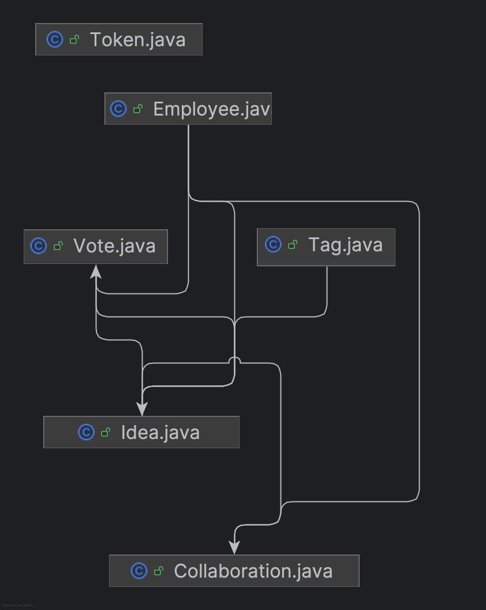

# Internal Idea Collaboration Platform

A Spring Boot-based web application that allows employees to create, vote on, and collaborate on ideas within an organization. This system uses JWT-based authentication and provides RESTful APIs for core features like login, idea creation, voting, and collaboration.

---

## Features

-  Employees Authentication (Login/Logout) with JWT
-  Submit and manage innovative ideas
-  List all the ideas sorted by vote or created time
-  Upvote on ideas
-  Collaborate on existing ideas
-  Get all employees collaborating on an idea
-  All APIs are in the collection file [View collaboration api.postman_collection.json](./collaboration api.postman_collection.json)


---

## 🛠️ Tech Stack

- **Backend**: Java 17, Spring Boot
- **Security**: Spring Security, JWT (JSON Web Token)
- **Database**: Postgres
- **Testing**: JUnit 5, MockMvc
- **Build Tool**: Maven

---

## 🛠️ Set up Database to start application
[View docker-compose.yml](./docker-compose.yml)

Run command ```docker-compose up -d``` in terminal


## 📁 Schema Structure


## 
